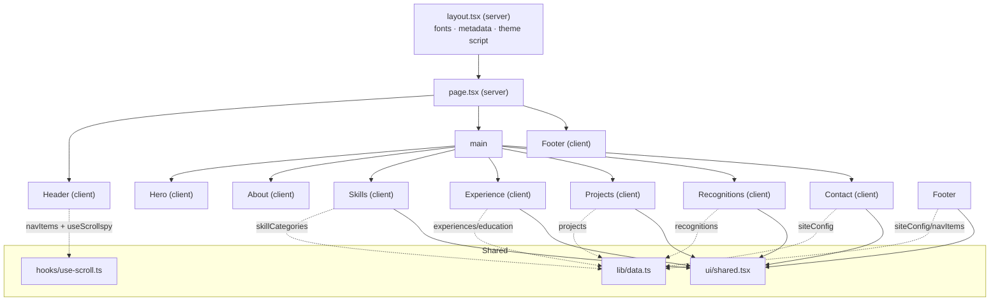
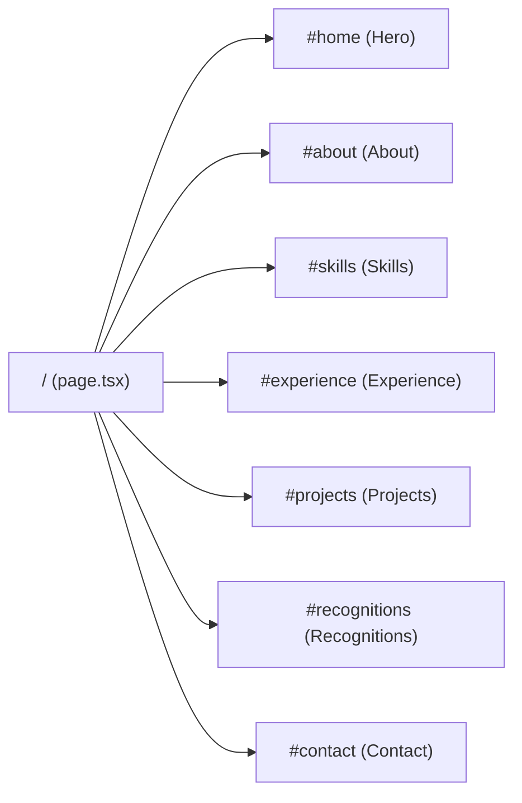
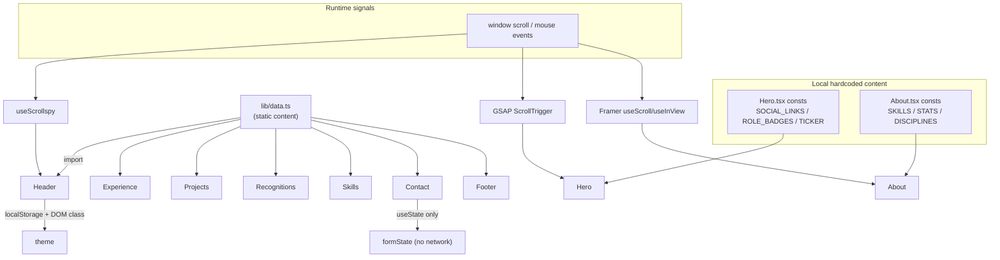

# Project Documentation — `src` Folder

> **Scope of this document.** This analysis is deliberately limited to the **`src/` folder** of the project, as requested. Configuration files at the repository root (`package.json`, `tsconfig.json`, `next.config.ts`, `eslint.config.mjs`, `postcss.config.mjs`), the legacy static site (`index.HTML`, `style.css`, `portfiloo.js`), the `public/` and `assets/` folders, and build output (`.next/`) are **out of scope** and are referenced only where a `src` file directly depends on them.
>
> No source code was modified while producing this document. Where behaviour had to be inferred rather than read directly, it is marked **(assumption)**.

---

## Table of Contents

1. [Project Overview](#1-project-overview)
2. [Tech Stack (as used inside `src`)](#2-tech-stack-as-used-inside-src)
3. [Folder Structure of `src`](#3-folder-structure-of-src)
4. [Application Architecture](#4-application-architecture)
5. [Routing](#5-routing)
6. [Components](#6-components)
7. [Hooks](#7-hooks)
8. [Contexts / Providers](#8-contexts--providers)
9. [Utilities](#9-utilities)
10. [Assets](#10-assets)
11. [Configuration Files (inside `src`)](#11-configuration-files-inside-src)
12. [Dependencies (as consumed by `src`)](#12-dependencies-as-consumed-by-src)
13. [UI Design System](#13-ui-design-system)
14. [Feature Breakdown](#14-feature-breakdown)
15. [Data Flow](#15-data-flow)
16. [State Management](#16-state-management)
17. [Performance](#17-performance)
18. [SEO](#18-seo)
19. [Accessibility](#19-accessibility)
20. [Security](#20-security)
21. [API Layer](#21-api-layer)
22. [File-by-File Documentation](#22-file-by-file-documentation)
23. [Known Issues](#23-known-issues)
24. [Improvement Suggestions](#24-improvement-suggestions)
25. [Future Roadmap](#25-future-roadmap)
26. [Build & Deployment](#26-build--deployment)
27. [Developer Notes](#27-developer-notes)

---

## 1. Project Overview

| Field | Value |
|---|---|
| **Project name** | `ahmed-elgabbas-portfolio` (from `package.json`; `siteConfig.name` = "Ahmed ElGabbas") |
| **Type** | Single-page personal developer portfolio |
| **Owner / subject** | Ahmed Mahmoud Ahmed ElGabbas — CS & AI student, Helwan National University |
| **Purpose** | Present the owner's identity, skills, education/experience, projects, recognitions, and a contact channel in a single, animation-rich landing page. |
| **Main goals** | (a) Establish a strong personal brand with a dark, editorial "systems-engineering" aesthetic; (b) Showcase full-stack/mobile skill breadth; (c) Provide a contact surface for freelance/full-time work. |
| **Current development status** | **Active work-in-progress.** The `src` app is a functioning Next.js App-Router site, but it still contains **template placeholder data from a different person** (see [§23](#23-known-issues)), **undefined CSS utility classes**, and **duplicated skill sections**. It is not yet production-clean. |

The `src` folder is the **only** live application. The root `index.HTML` / `style.css` / `portfiloo.js` are a superseded static predecessor and are out of scope here.

---

## 2. Tech Stack (as used inside `src`)

| Layer | Technology | Evidence in `src` |
|---|---|---|
| **Framework** | Next.js (App Router) | `src/app/layout.tsx`, `src/app/page.tsx`, `next/font/google`, `next/image` |
| **UI library** | React 19 (function components + hooks) | every `.tsx` file |
| **Language** | TypeScript (strict) | all `.ts`/`.tsx`; interfaces & typed props throughout |
| **Styling** | Tailwind CSS v4 (CSS-first `@theme`) + custom CSS layers | `src/app/globals.css` |
| **Animation** | Framer Motion (`motion`, `AnimatePresence`, `useScroll`, `useInView`, `useTransform`, `animate`) | `Hero`, `About`, `Header`, `Skills`, `shared`, etc. |
| **Animation (imperative)** | GSAP + `ScrollTrigger` | `src/components/sections/Hero.tsx` |
| **3D** | Three.js via `@react-three/fiber` (and `@react-three/drei` available) | `Hero.tsx` `ParticleField` / `HeroBackground` |
| **Icons** | `lucide-react` and `react-icons` (`fa`, `si`) | `Header`, `Hero`, `Contact`, `Footer`, `About` |
| **Class utilities** | `clsx` + `tailwind-merge` (`cn`) | `src/lib/utils.ts` |
| **State management** | **Local component state only** (`useState`/`useRef`) — no Redux/Zustand/Context | see [§16](#16-state-management) |
| **Fonts** | Google Fonts via `next/font/google` | `layout.tsx` |
| **Package manager** | npm (root `package-lock.json`) — *root scope* | — |

---

## 3. Folder Structure of `src`

```
src/
├── app/                     # Next.js App Router entrypoints
│   ├── globals.css          # Tailwind v4 theme + base/components/keyframes
│   ├── layout.tsx           # Root layout: fonts, <html>/<body>, metadata, theme bootstrap
│   └── page.tsx             # Home route — composes all sections
│
├── assets/
│   └── images/
│       └── logo.png         # Brand logo, imported statically by Header
│
├── components/
│   ├── sections/            # One file per page section
│   │   ├── Header.tsx        # Fixed nav bar + mobile drawer + theme toggle
│   │   ├── Hero.tsx          # 3D particle hero (self-contained, GSAP + R3F)
│   │   ├── About.tsx         # Identity + stats + SkillsPanel ("System Topology")
│   │   ├── Skills.tsx        # Second, data-driven skills grid (duplicate topic)
│   │   ├── Experience.tsx    # Education + experience timeline
│   │   ├── Projects.tsx      # Project cards
│   │   ├── Recognitions.tsx  # Awards / leadership cards
│   │   ├── Contact.tsx       # Contact details + decorative form
│   │   └── Footer.tsx        # Brand, nav, "built with", copyright
│   └── ui/
│       └── shared.tsx        # Reusable primitives (SectionHeading, GradientDivider, +5 unused)
│
├── hooks/
│   └── use-scroll.ts         # useScrollspy (used) + useMediaQuery, useMousePosition (unused)
│
└── lib/
    ├── data.ts               # Central content model (siteConfig, nav, experiences, projects…)
    ├── animations.ts         # Framer-Motion variant presets (currently UNUSED)
    └── utils.ts              # cn() classname helper
```

> **Note:** git history shows a former `src/components/sections/hero-section/` sub-folder (`Background.tsx`, `LeftContent.tsx`, `Portrait.tsx`, `ScrollIndicator.tsx`, `SpineLabel.tsx`, `data.ts`, `index.tsx`). Those files have been **deleted from disk** and their logic folded into the single `Hero.tsx`. They are not part of the current `src` tree.

---

## 4. Application Architecture

The `src` app follows the **Next.js App Router + section-composition** pattern:

- **Server shell, client leaves.** `layout.tsx` and `page.tsx` are server components. Every section that needs interactivity/animation begins with `"use client"` (11 client files total). This keeps the initial HTML server-rendered while hydrating interactive islands.
- **Single-page composition.** `page.tsx` imports each section component and stacks them; there is no nested routing.
- **Content/presentation split — partial.** `src/lib/data.ts` centralises most textual content, consumed by `Experience`, `Projects`, `Recognitions`, `Skills`, `Contact`, `Footer`, `Header`. **However**, `Hero.tsx` and `About.tsx` hold their own hardcoded content constants (`SOCIAL_LINKS`, `ROLE_BADGES`, `SKILLS`, `STATS`, `DISCIPLINES`…), so the model is **not** fully centralised.
- **Design tokens in CSS.** Colors, fonts, easings and durations live as CSS variables in `globals.css`'s `@theme`, exposed to Tailwind utilities.



---

## 5. Routing

The app uses the **App Router** with a **single route**.

| Route | File | Rendering | Purpose |
|---|---|---|---|
| `/` | `src/app/page.tsx` | Server component (hydrates client sections) | The entire portfolio |

There are **no** additional route segments, dynamic routes, route groups, API routes (`route.ts`), `loading.tsx`, `error.tsx`, or `not-found.tsx` inside `src`. Next.js will supply a default 404.

**In-page navigation** is hash-based, not route-based. `navItems` in `data.ts` define anchors, and navigation is performed via `element.scrollIntoView({ behavior: "smooth" })` (`Header.handleNavClick`) plus CSS `scroll-behavior: smooth`.



> **Anchor/label mismatch (assumption of intent):** `navItems` labels read *Home, About, Skills, Qualifications, Projects, Certificates*, but the section `id`s they point to are `#home, #about, #skills, #experience, #projects, #recognitions`. There is **no `#skills`-vs-`#about` disambiguation issue**, but note the `Skills` section owns `#skills` while `About` also renders a "System Topology" skills panel — see [§23](#23-known-issues).

---

## 6. Components

All components are documented below. "Used in" is verified by import graph.

### 6.1 Section components (`src/components/sections`)

#### `Header.tsx`
| Aspect | Detail |
|---|---|
| **Purpose** | Fixed top navigation: logo+name, desktop nav with active-link indicator, contact button, theme toggle, mobile slide-in drawer. |
| **Props** | None. |
| **Key state** | `isScrolled`, `isMobileOpen`, `theme` (`"dark"\|"light"`), `mounted`; `toggleRef` for focus return. |
| **Internal logic** | • `useScrollspy` computes the active section id (offset 150). • Scroll listener toggles a blurred/opaque header past 50px. • Body-scroll lock while the mobile drawer is open. • Theme toggle writes `localStorage.theme` and flips `documentElement` `dark`/`light` classes. • `Escape` closes the drawer and restores focus. • Nav clicks `preventDefault` + smooth-scroll to the target. |
| **Dependencies** | `framer-motion` (`motion`, `AnimatePresence`, `layoutId` nav indicator), `lucide-react` (`Menu, X, Sun, Moon`), `next/image`, `@/lib/data` (`navItems`), `@/hooks/use-scroll` (`useScrollspy`), `@/assets/images/logo.png`. |
| **Used in** | `page.tsx`. |
| **Issues** | `w-35 h-35` and `gap-` / `gap-` (empty) are **invalid Tailwind classes**; light theme has no CSS so toggling has no visible effect (see [§23](#23-known-issues)). |

#### `Hero.tsx`
| Aspect | Detail |
|---|---|
| **Purpose** | Landing hero: ambient Three.js particle field, four animated corner brackets, availability badge, split-letter animated headline, role badges, bio + social links, CTAs (one magnetic), scroll cue, looping tech ticker. |
| **Props** | None (default export `Hero`). |
| **Sub-components (module-local)** | `ParticleField`, `HeroBackground`, `MagneticWrapper`, `AnimatedLetters`. |
| **Custom hook (module-local)** | `useHeroEntranceAnimation({ sectionRef, headlineRef, descriptionPanelRef, footerBarRef, tickerRef })` — GSAP timeline (brackets → letters → panel → footer → ticker) + two `ScrollTrigger` parallax tweens; wrapped in `gsap.context` and reverted on unmount. |
| **Constants** | `PARTICLE_COUNT=6000`, `PARTICLE_GRID_COLUMNS=100`, `ENTRANCE_TIMELINE_DELAY=0.3`, `MAGNETIC_SPRING_TRANSITION`, `SOCIAL_LINKS`, `ROLE_BADGES`, `TICKER_ITEMS`. |
| **Internal logic** | `ParticleField` lays 6000 points on a grid and each frame displaces Y by two sine/cosine waves + a cursor-proximity "bump", then slowly rotates the field. `MagneticWrapper` translates children toward the cursor with a spring. `AnimatedLetters` wraps each character in `.split-letter` spans (GSAP staggers them) with an `aria-label` fallback. |
| **Dependencies** | `framer-motion`, `gsap` + `gsap/ScrollTrigger`, `@react-three/fiber` (`Canvas, useThree, useFrame`), `three` (`AdditiveBlending`, `Points`), `lucide-react` (`ArrowUpRight, Github, Linkedin, Mail`). |
| **Used in** | `page.tsx`. |
| **Issues** | `SOCIAL_LINKS` point to **"Nikhil-Madaravena" / nikhil.madaravena@gmail.com** (wrong person); role/ticker content ("Rust · React · Java", "Spring Boot", "Systems Engineer") does not match Ahmed's real stack; multiple **undefined CSS classes** (`hollow-name`, `shine-sweep`, `ambient-glow`, `animate-pulse-ring`, `ticker-inner`, `text-mono-*`). See [§23](#23-known-issues). |

#### `About.tsx`
| Aspect | Detail |
|---|---|
| **Purpose** | "Identity" section: headline, animated stat counters, scroll-reveal biography paragraph, two "discipline" blocks, "Core Arsenal" tag cloud, and an embedded tabbed **SkillsPanel** ("System Topology"). |
| **Props** | None. |
| **Sub-components (module-local)** | `AnimatedCounter`, `ScrollRevealText` + `Word`, `SkillsPanel`, plus `VsCodeIcon` and `resolveIcon`. |
| **Data (module-local)** | `SKILLS[]` (40 entries with `percentage`/`category`/`icon`), `CATEGORIES[]`, `STATS[]`, `DISCIPLINES[]`, `CORE_ARSENAL[]`, `ICONS` map. |
| **Internal logic** | `AnimatedCounter` uses Framer's imperative `animate()` and writes `textContent` directly per frame (bypasses React state) once in view. `ScrollRevealText` derives each word's opacity/`y` from `useScroll` progress across its own bounding box. `SkillsPanel` filters `SKILLS` by active tab, renders animated progress bars and a `SYS_MASTER/ADVANCED/PROFICIENT` tier from `percentage`. |
| **Dependencies** | `framer-motion` (`motion, AnimatePresence, animate, useAnimation, useInView, useScroll, useTransform`), `react-icons/fa` + `react-icons/si` (37 named icons), local `VsCodeIcon`. |
| **Used in** | `page.tsx`. |
| **Issues** | Bio text hardcodes "**Based in Telangana, India**" (Contact says Giza, Egypt); overlaps heavily with the separate `Skills.tsx`; references undefined `text-gradient` / `text-mono-*` / `shine-sweep`. |

#### `Skills.tsx`
| Aspect | Detail |
|---|---|
| **Purpose** | A **second** skills view: tabbed grid built from `skillCategories` in `lib/data.ts`, with `NODE_xxx` labels, synthetic percentages, and level tags. |
| **Props** | None. |
| **State** | `activeTab` (index into `skillCategories`). |
| **Internal logic** | `getSkillPercent(i)=clamp(95−3i, 65..95)` and `getSkillLevel(i)` (index<3 master, <6 advanced, else proficient) generate **fake, position-based** metrics. |
| **Dependencies** | `framer-motion`, `@/components/ui/shared` (`SectionHeading`), `@/lib/data` (`skillCategories`). |
| **Used in** | `page.tsx`. |
| **Issues** | Redundant with `About.SkillsPanel`; both claim to be "System Topology". Percentages are cosmetic. |

#### `Experience.tsx`
| Aspect | Detail |
|---|---|
| **Purpose** | Two-column "Background": Education card(s) + Experience cards. |
| **Props** | None. |
| **Data source** | `experiences`, `education` from `lib/data.ts`. |
| **Internal logic** | Maps `education` (one entry) with a **hardcoded 5-bullet list** rendered regardless of the data; maps `experiences` into cards with tech tags and a static "Currently Active" badge. |
| **Dependencies** | `framer-motion`, `@/components/ui/shared` (`SectionHeading`, `GradientDivider`), `@/lib/data`. |
| **Used in** | `page.tsx`. |

#### `Projects.tsx`
| Aspect | Detail |
|---|---|
| **Purpose** | Vertical list of project cards with number, 2-letter abbreviation, description, tech tags, and two action buttons. |
| **Data source** | `projects` from `lib/data.ts`. |
| **Internal logic** | Derives `num` (zero-padded index) and `abbr` (first letters of title words, first 2). Shows a `featured` badge conditionally. |
| **Dependencies** | `framer-motion`, `lucide-react` (`ExternalLink, Github`), `@/components/ui/shared`, `@/lib/data`. |
| **Used in** | `page.tsx`. |
| **Issues** | Both action links are `href="#"` placeholders — no live/repo URLs in the data model. |

#### `Recognitions.tsx`
| Aspect | Detail |
|---|---|
| **Purpose** | 3-column grid of recognition/leadership cards + a "Ledger_End" footer line. |
| **Data source** | `recognitions` from `lib/data.ts`. |
| **Internal logic** | Zero-padded number, static `2024` year and static "Verified / Active_Role" badges per card. |
| **Dependencies** | `framer-motion`, `@/components/ui/shared` (`SectionHeading`), `@/lib/data`. |
| **Used in** | `page.tsx`. |

#### `Contact.tsx`
| Aspect | Detail |
|---|---|
| **Purpose** | Contact details (location, phone, email, GitHub) + an "Open to Work" card + a contact form. |
| **State** | `formState {name,email,subject,message}`, `submitted`. |
| **Internal logic** | `handleSubmit` calls `preventDefault`, sets `submitted=true`, then after 3s resets the form. **No network request is made** — the form is decorative. |
| **Dependencies** | `framer-motion`, `@/components/ui/shared` (`SectionHeading`), `@/lib/data` (`siteConfig`), `lucide-react` (`MapPin, Phone, Mail, Github, Send`). |
| **Used in** | `page.tsx`. |

#### `Footer.tsx`
| Aspect | Detail |
|---|---|
| **Purpose** | Footer with brand block, social links, navigation mirror, "Built With" list, copyright. |
| **Data source** | `siteConfig.links`, `navItems`. |
| **Dependencies** | `framer-motion`, `lucide-react` (`Github, Linkedin, Twitter, Facebook`), `@/components/ui/shared` (`GradientDivider`), `@/lib/data`. |
| **Used in** | `page.tsx`. |

### 6.2 UI primitives (`src/components/ui/shared.tsx`)

| Export | Purpose | Props | Used by |
|---|---|---|---|
| `SectionHeading` | Standard section header: mono eyebrow (`index // label`), animated `h2` title, optional subtitle. | `index, label, title, subtitle?` | Skills, Experience, Projects, Recognitions, Contact |
| `GradientDivider` | Scroll-revealed 1px horizontal gradient line (`scaleX` 0→1). | none | Experience, Projects, Footer |
| `ParallaxText` | Giant outlined parallax word tied to scroll. | `children, className?` | **Unused** |
| `Ticker` | Infinite horizontal skills marquee. | none | **Unused** |
| `FloatingBadge` | Pill badge with entrance animation. | `children, className?` | **Unused** |
| `TechBadge` | Small mono tech-name pill. | `label` | **Unused** |
| `MetricCard` | Value + label stat block. | `value, label, delay?` | **Unused** |

> Five of seven exports here are dead code (see [§23](#23-known-issues)).

---

## 7. Hooks

All custom hooks live in `src/hooks/use-scroll.ts` (marked `"use client"`).

### `useScrollspy(ids: string[], offset = 100): string`
- **Purpose:** Returns the id of the section currently in view.
- **Logic:** On scroll (passive listener) computes `window.scrollY + offset`, iterates ids **from last to first**, returns the first whose `element.offsetTop <= scrollPosition`; falls back to `ids[0]`. `handleScroll` is memoised with `useCallback([ids, offset])`; an initial `queueMicrotask(handleScroll)` seeds state after mount.
- **Used by:** `Header.tsx` (offset 150).
- **Note:** `ids` is passed as a freshly-mapped array on each render (`navItems.map(...)`), so `useCallback`/`useEffect` re-run every render — minor inefficiency (**assumption**: acceptable given tiny list).

### `useMediaQuery(query: string): boolean` — **unused**
- Wraps `window.matchMedia`, updates on `change`. Uses `queueMicrotask` to set initial match. No importers in `src`.

### `useMousePosition(): {x, y}` — **unused**
- Tracks `mousemove` and returns `{x, y}`. No importers in `src`.

There are **no** other hooks folders. `useHeroEntranceAnimation` is a module-local hook defined **inside** `Hero.tsx` (documented in [§6](#6-components)), not exported.

---

## 8. Contexts / Providers

**None.** The `src` tree defines **no** React Context, Provider, or global store. Cross-cutting state is limited to:

- **Theme:** managed imperatively via `localStorage` + `documentElement` class toggling in `Header.tsx` and the inline bootstrap script in `layout.tsx` (not a React context).
- **Three.js Canvas context:** `@react-three/fiber`'s `<Canvas>` provides an internal R3F context consumed by `useThree`/`useFrame` inside `Hero.ParticleField` — but this is library-internal, not an app-level provider.

If future global state (theme, i18n, analytics) is needed, a `providers.tsx` client wrapper in `src/app` would be the idiomatic home (**assumption/recommendation**).

---

## 9. Utilities

### `src/lib/utils.ts`
- `cn(...inputs: ClassValue[])` → `twMerge(clsx(inputs))`. Merges conditional class names and de-duplicates conflicting Tailwind utilities.
- **Usage note:** exported but, at the time of analysis, **no `src` file imports `cn`** — components write class strings inline. It is effectively unused today but is a standard, safe helper to keep.

### `src/lib/animations.ts` — **entire file unused**
Exports Framer-Motion `Variants` presets: `fadeInUp`, `fadeInDown`, `fadeIn`, `fadeInLeft`, `fadeInRight`, `scaleIn`, `staggerContainer`, `staggerItem`, `slideInFromLeft`, `slideInFromRight`, `letterAnimation`, `lineReveal`, and the `cardHover` object. **No component imports from `@/lib/animations`** — sections define their variants inline instead. This is a ready-made library that is currently dead code.

### `src/lib/data.ts` — content model (see [§22](#22-file-by-file-documentation))
Not "utilities" per se, but the central data helper module. Exports: `siteConfig`, `stats` (**unused**), `experiences`, `education`, `skillCategories`, `projects`, `recognitions`, `navItems`.

Helper functions inside components (not in `lib`): `getSkillLevel`/`getSkillPercent` (`Skills.tsx`), `resolveIcon` (`About.tsx`), `abbr` derivation (`Projects.tsx`).

---

## 10. Assets

The only asset **inside `src`** is:

| Asset | Path | Type | Used by | How |
|---|---|---|---|---|
| Brand logo | `src/assets/images/logo.png` | PNG (~42 KB) | `Header.tsx` | `import logo from "@/assets/images/logo.png"` → `next/image` `<Image src={logo} priority />` |

Importing the image as a module lets Next.js provide width/height and optimise it. All other imagery/resume/SVGs live under `public/` and `assets/` (out of scope).

> The logo `<Image>` uses `className="w-35 h-35"`, which is **not a valid Tailwind size** — the intrinsic import dimensions will govern rendering instead (**assumption**).

---

## 11. Configuration Files (inside `src`)

The only configuration-like file within `src` is the **stylesheet/theme**:

### `src/app/globals.css`
- `@import "tailwindcss";` — Tailwind v4 entry.
- **`@theme` block** — design tokens exposed as CSS variables and Tailwind utilities:
  - Font families: `--font-sans` (Space Grotesk), `--font-display` (Syne), `--font-mono` (JetBrains Mono), `--font-name` (Playfair Display).
  - Brand colors: `--color-background #080808`, `--color-foreground`, `--color-muted*`, `--color-border*`, `--color-card*`, `--color-accent`, `--color-surface`.
  - Hero design tokens: `--color-bg-base`, `--color-surface-1..3`, `--color-primary*` (teal family), `--color-heading/body`, code-syntax colors, traffic-light colors.
  - Animation tokens: `--ease-out-expo`, `--ease-standard`, `--duration-fast/base/slow/ambient`.
- **`@layer base`** — global reset, smooth scroll, thin scrollbar styling, `body` typography, `::selection`, heading font.
- **`@layer components`** — helper classes: `.section-container`, `.section-container-hero`, `.section-padding`, `.gradient-text`, `.gradient-line`, `.glass-card`, hero glow/shadow utilities, `.dot-pattern`, `.noise-bg`, `.text-stroke`, and `animate-*` classes bound to keyframes.
- **Keyframes:** `float`, `float-soft`, `pulse-slow`, `badge-pulse`, `scroll-dot`, `grain`.

> **Config note:** the app's root TS path alias `@/* → ./src/*` (from `tsconfig.json`, root scope) is what makes every `@/components`, `@/lib`, `@/hooks`, `@/assets` import inside `src` resolve. Google fonts are wired in `layout.tsx`, and the teal `--color-primary*` tokens defined here are **not currently referenced** by any `src` component (the live design is monochrome).

---

## 12. Dependencies (as consumed by `src`)

Only dependencies actually imported by `src` files are listed (root `package.json` is out of scope for justification of every entry).

| Package | Imported in | Why it exists |
|---|---|---|
| `next` | `layout.tsx`, `page.tsx`, `Header.tsx` | App Router, `next/font/google`, `next/image`, `Metadata`. |
| `react` / `react-dom` | all `.tsx` | Core UI runtime + hooks. |
| `framer-motion` | most sections + `shared.tsx` | Declarative entrance/scroll animations, `AnimatePresence`, `layoutId`, `useScroll`/`useInView`/`useTransform`/`animate`. |
| `gsap` (+ `ScrollTrigger`) | `Hero.tsx` | Imperative entrance timeline & scroll parallax for the hero. |
| `@react-three/fiber` | `Hero.tsx` | React renderer for Three.js (particle field canvas). |
| `three` | `Hero.tsx` | 3D primitives (`Points`, `AdditiveBlending`). |
| `@react-three/drei` | *(not imported in `src`)* | Available but unused inside `src` at analysis time. |
| `lucide-react` | `Header, Hero, Projects, Contact, Footer` | Line icons. |
| `react-icons` (`fa`, `si`) | `About.tsx` | Brand/tech icons for the SkillsPanel. |
| `clsx` + `tailwind-merge` | `lib/utils.ts` | `cn()` classname merge helper (currently unused by components). |
| `class-variance-authority` | *(not imported in `src`)* | Available but unused inside `src`. |
| `tailwindcss` / `@tailwindcss/postcss` / `autoprefixer` / `postcss` | `globals.css` (build) | Styling toolchain. |

**Unused-in-`src` at analysis time:** `@react-three/drei`, `class-variance-authority` (and, functionally, `clsx`/`tailwind-merge` via the unimported `cn`).

---

## 13. UI Design System

### Colors
- **Palette:** near-black canvas (`#080808` / `#020202` for the hero 3D scene) with a **monochrome white-alpha system** — borders `white/[0.06]`→`white/[0.25]`, text `neutral-300…700`, fills `white/[0.02]…[0.06]`.
- **Accent:** a teal family (`--color-primary #1fbea2`, etc.) is **defined but unused** by live components; the only visible accent is emerald in the Contact/Experience "active" badges (`emerald-400/500`).
- **Gradients:** `.gradient-text` (white→grey), `.gradient-line`, and inline radial "orb" glows.

### Typography
| Token | Font | Role |
|---|---|---|
| `--font-sans` | Space Grotesk | Body / default |
| `--font-display` | Syne | Headings (`h1..h6` via base layer) & display numbers |
| `--font-mono` | JetBrains Mono | Eyebrows, labels, node ids, ticker (`font-mono`) |
| `--font-name` | Playfair Display | Defined for name styling (**assumption**: intended for a serif name treatment; not clearly used) |

Heavy use of **uppercase micro-labels** with wide letter-spacing (`tracking-[0.15em]…[0.35em]`) and tiny sizes (`text-[8px]…[11px]`) for the "technical HUD" aesthetic.

### Spacing & Layout
- Containers: `.section-container` (max 1200px) and `.section-container-hero` (max 1440px), responsive horizontal padding (24 → 48 → 64px).
- Vertical rhythm: `.section-padding` (120px desktop / 80px mobile); several sections use `py-32`/`py-16` directly.
- Grids: 12-column `lg:grid-cols-12` splits (Experience, Projects, Recognitions, About) and responsive card grids (`sm:grid-cols-2 lg:grid-cols-3/4`).

### Animations
- **Framer Motion:** `whileInView` reveals with `viewport={{ once: true }}`, staggered children, `layoutId` shared-element indicators (nav underline, active tab dot), `AnimatePresence` for tab/menu transitions.
- **GSAP (hero only):** entrance timeline + `ScrollTrigger` parallax.
- **CSS keyframes:** `float`, `pulse-slow`, `badge-pulse`, `scroll-dot`, `grain` (some referenced via undefined helper classes — see issues).
- **Micro-interactions:** magnetic button, shine-sweep hovers (class undefined), corner-bracket reveals, animated counters, scroll-scrubbed word reveal.

### Responsive behaviour
- Mobile-first Tailwind breakpoints (`sm/md/lg/xl`).
- `Header` collapses desktop nav into a slide-in drawer under `lg`.
- Font sizes use `clamp()` in the hero headline for fluid scaling.
- `overflow-x-hidden` on `body` prevents horizontal scroll from oversized decorative text.

---

## 14. Feature Breakdown

### F1 — Sticky navigation + scrollspy
- **What:** Fixed header that highlights the active section and smooth-scrolls to anchors; becomes opaque/blurred after 50px.
- **Files:** `Header.tsx`, `hooks/use-scroll.ts`, `lib/data.ts` (`navItems`).
- **User flow:** user scrolls / clicks a nav item → active indicator moves → page smooth-scrolls to the section.
- **Internal flow:** scroll listener → `useScrollspy` returns id → conditional classes + `layoutId` indicator animate.

### F2 — 3D animated hero
- **What:** GPU particle field reacting to the cursor, animated headline, corner brackets, magnetic CTA, ticker.
- **Files:** `Hero.tsx`, `globals.css` (partial), fonts via `layout.tsx`.
- **User flow:** on load, entrance timeline plays; moving the mouse deforms the particle field and pulls the "Hire Me" button.
- **Internal flow:** `useHeroEntranceAnimation` GSAP timeline + `ScrollTrigger`; `ParticleField` per-frame math in `useFrame`; `MagneticWrapper` spring.

### F3 — Identity / About + stats + skills panel
- **Files:** `About.tsx`.
- **Flow:** section enters view → counters animate, biography words reveal on scroll, skill tabs filter the grid, progress bars fill.

### F4 — Skills (secondary grid)
- **Files:** `Skills.tsx`, `lib/data.ts` (`skillCategories`).
- **Flow:** tab click → `activeTab` state → `AnimatePresence` swaps the grid; synthetic percentages animate.

### F5 — Education & Experience timeline
- **Files:** `Experience.tsx`, `lib/data.ts`.

### F6 — Projects showcase
- **Files:** `Projects.tsx`, `lib/data.ts`.

### F7 — Recognitions ledger
- **Files:** `Recognitions.tsx`, `lib/data.ts`.

### F8 — Contact
- **Files:** `Contact.tsx`, `lib/data.ts` (`siteConfig`).
- **Flow:** fill form → submit → optimistic "Message Sent!" for 3s → reset. **No delivery** (see [§21](#21-api-layer)).

### F9 — Theme toggle (dark/light)
- **Files:** `Header.tsx`, `layout.tsx` (inline bootstrap).
- **Flow:** click toggle → `localStorage.theme` set → `<html>` class flips. **Currently only dark styles exist**, so light mode is a no-op visually.

### F10 — Footer
- **Files:** `Footer.tsx`, `lib/data.ts`.

---

## 15. Data Flow



- **Content:** flows **one-way** from `lib/data.ts` (and per-component constants) into JSX. Nothing is fetched.
- **Interaction:** browser scroll/mouse events feed hooks and animation libraries, which update DOM/state.
- **Persistence:** only the theme preference persists (`localStorage`).

---

## 16. State Management

All state is **local** (no global store, no context). Summary:

| Component | State | Purpose |
|---|---|---|
| `Header` | `isScrolled, isMobileOpen, theme, mounted` | header style, drawer, theme, hydration guard |
| `Hero` | refs only (`sectionRef`, `headlineRef`, …); `MagneticWrapper` → `magneticOffset` | animation targets & magnetic offset |
| `About` | `useAnimation` controls + `useInView`; `SkillsPanel` → `activeId`; `AnimatedCounter` refs | reveal orchestration & active skill tab |
| `Skills` | `activeTab` | selected category |
| `Contact` | `formState, submitted` | controlled form + optimistic UI |
| others | none | purely presentational |

- **Hydration pattern:** `Header` uses a `mounted` flag so `localStorage`-derived theme UI only renders after hydration (with an ESLint disable for `set-state-in-effect`). The inline script in `layout.tsx` pre-sets `<html>` classes to avoid a flash/mismatch.

---

## 17. Performance

**Strengths**
- **Server components** for `layout`/`page`; only interactive sections are `"use client"`.
- **`next/font/google`** with `display:swap`, preloading, and CSS-variable exposure (no render-blocking font `<link>`s).
- **`next/image`** for the logo (`priority`) with static import dimensions.
- **`useInView` / `whileInView once:true`** so reveals fire once and don't re-run.
- **Passive scroll listeners** (`{ passive: true }`).
- **Imperative counter animation** in `About.AnimatedCounter` writes `textContent` directly, avoiding 60fps React re-renders.
- **GSAP `context().revert()`** cleans up all tweens/ScrollTriggers on unmount.

**Bottlenecks / risks**
- **Hero particle field:** 6000 points recomputed **every frame on the CPU** (`useFrame` JS loop mutating a `Float32Array` + `needsUpdate`) — the heaviest cost; can jank on low-end devices/mobile. No reduced-motion guard.
- **`react-icons`:** `About.tsx` imports 37 named icons (good — tree-shakeable), but pulling from `fa`+`si` still adds weight.
- **Three duplicate tickers/skills** and dead modules (`animations.ts`, five `shared.tsx` exports, two hooks) add bundle/source weight without value.
- **`useScrollspy` deps churn:** `navItems.map()` recreates the array each render, re-subscribing the scroll listener each render.
- **No memoization** of section lists (small data, low impact).

---

## 18. SEO

Handled in `src/app/layout.tsx` via the App Router `metadata` export:
- `title`, `description`, `keywords[]`, `authors`, `openGraph` (type/title/description/locale), `twitter` (`summary_large_image`).
- `<meta name="theme-color" content="#080808">`, `lang="en"`.

**Gaps (inside `src`):**
- **No `metadataBase`**, so OG/Twitter URLs won't be absolute.
- **No OG/Twitter image** (`images`) despite `summary_large_image`.
- **No `sitemap.ts` / `robots.ts`** in `src/app`.
- **No JSON-LD** (`Person`/`WebSite`) structured data.
- **Single `<h1>`** exists (hero), but the second skills section and duplicated headings could dilute semantics.
- `siteConfig.url` (`https://ahmedelgabbas.dev`) exists in `data.ts` but isn't wired into metadata.

---

## 19. Accessibility

**Good**
- `Header` toggle has `aria-label`, `aria-pressed`, `aria-expanded`, `aria-controls`; mobile drawer uses `role="dialog"`, `aria-modal`, `aria-label`; `Escape` closes and restores focus.
- `AnimatedLetters` sets `aria-label={text}` so screen readers announce whole words, not per-letter spans.
- Social/footer icon links use `aria-label`; external links use `rel="noopener noreferrer"`.
- Form inputs have associated `<label htmlFor>`.

**Issues / improvements**
- **Very low contrast** micro-text (`neutral-600/700`, `text-[8px]`) fails WCAG AA in many places.
- **No `prefers-reduced-motion`** handling anywhere — heavy motion (particles, parallax, counters) can't be disabled.
- Decorative giant background words rely on `select-none`/`pointer-events-none` but are still DOM text (mostly fine).
- **Undefined color classes** (`text-mono-*`) fall back to inherited color, making some intended contrast unpredictable.
- Placeholder `href="#"` project buttons are focusable but do nothing (confusing for keyboard/AT users).
- Light theme toggles a class with **no matching styles**, so a user who prefers light mode gets no change and no feedback.

---

## 20. Security

- **Authentication:** none (static marketing site) — appropriate.
- **Validation:** the Contact form uses HTML `required`/`type=email` only; since nothing is submitted server-side, there is no server validation surface. If a backend is added, validate + rate-limit.
- **Secrets:** none present in `src` (no env usage, no keys). Good.
- **XSS surface:** `layout.tsx` uses `dangerouslySetInnerHTML` for the theme bootstrap script — content is a **static literal**, so safe. No user-controlled HTML is injected anywhere.
- **External links:** `target="_blank"` links correctly use `rel="noopener noreferrer"`.
- **Risk notes:** hardcoded **personal email/phone** (`siteConfig`) are public by design but will attract scraping; the leftover **third-party name/email in `Hero.tsx`** is a data-integrity/privacy issue to remove.

---

## 21. API Layer

**There is no API layer inside `src`.**
- No `fetch`/`axios`, no `route.ts`, no server actions, no external API calls.
- The Contact form (`Contact.tsx`) is **client-only** and **does not send** data — `handleSubmit` merely toggles UI state.
- The only "remote" concept is the root `next.config.ts` `remotePatterns` for `d3moma7wl9.ufs.sh`, which **no `src` component uses** (the logo is a local import). *(root scope — noted for completeness.)*

To make Contact functional, add a `src/app/api/contact/route.ts` (or a server action) integrating an email provider (Resend/Nodemailer/Formspree).

---

## 22. File-by-File Documentation

| File | Responsibility | Notable details |
|---|---|---|
| `src/app/layout.tsx` | Root layout; loads 4 Google fonts as CSS vars; exports `metadata`; renders `<html>`/`<body>`; injects inline theme-bootstrap script; sets `theme-color`. | `suppressHydrationWarning`; body defaults to dark (`bg-[#080808] text-white`). |
| `src/app/page.tsx` | Home route; composes `Header` + `<main>`(7 sections) + `Footer`. | Pure composition, no logic. |
| `src/app/globals.css` | Tailwind v4 entry + `@theme` tokens + base/components layers + keyframes. | Defines teal accent tokens (unused) and helper classes; **missing** several classes components reference. |
| `src/assets/images/logo.png` | Brand logo bitmap. | Imported by `Header`. |
| `src/components/sections/Header.tsx` | Fixed nav, scrollspy, mobile drawer, theme toggle. | Invalid `w-35 h-35`/`gap-` classes; light theme no-op. |
| `src/components/sections/Hero.tsx` | 3D particle hero + entrance choreography. | Self-contained; **placeholder identity (Nikhil)**; undefined CSS classes; CPU particle loop. |
| `src/components/sections/About.tsx` | Identity, counters, scroll-reveal bio, embedded SkillsPanel. | Owns 40-item `SKILLS`; "Telangana, India" text; overlaps `Skills.tsx`. |
| `src/components/sections/Skills.tsx` | Secondary tabbed skills grid from `lib/data`. | Synthetic percentages; duplicate of About's panel. |
| `src/components/sections/Experience.tsx` | Education + experience cards. | Education bullets hardcoded, not data-driven. |
| `src/components/sections/Projects.tsx` | Project cards with derived number/abbr. | Action links are `#` placeholders. |
| `src/components/sections/Recognitions.tsx` | Recognition/leadership grid + ledger footer. | Static year/badges. |
| `src/components/sections/Contact.tsx` | Contact info + decorative form. | No network; optimistic UI only. |
| `src/components/sections/Footer.tsx` | Brand, socials, nav mirror, built-with, copyright. | Copyright "© 2026". |
| `src/components/ui/shared.tsx` | Reusable UI primitives. | Only `SectionHeading` + `GradientDivider` used; 5 exports dead. |
| `src/hooks/use-scroll.ts` | `useScrollspy` (used) + `useMediaQuery`, `useMousePosition` (unused). | Passive listeners; `queueMicrotask` seeding. |
| `src/lib/data.ts` | Central content: `siteConfig`, `stats`(unused), `experiences`, `education`, `skillCategories`, `projects`, `recognitions`, `navItems`. | Single source for most sections. |
| `src/lib/animations.ts` | Framer variant presets + `cardHover`. | **Entirely unused.** |
| `src/lib/utils.ts` | `cn()` classname merge helper. | Exported but not imported by any component. |

---

## 23. Known Issues

**Correctness / data integrity (high priority)**
1. **Wrong-person placeholder data in `Hero.tsx`:** `SOCIAL_LINKS` link to `github.com/Nikhil-Madaravena`, `linkedin.com/in/nikhil-madaravena`, and `nikhil.madaravena@gmail.com`. These belong to a different individual and must be replaced with Ahmed's real links (already present in `siteConfig`).
2. **Inconsistent identity/stack:** Hero role badges & ticker advertise "Rust · React · Java / Spring Boot / Systems Engineer"; About says "**Based in Telangana, India**" and "Rust in-memory databases"; but `data.ts`/Contact describe a **Flutter/.NET/React developer in Giza, Egypt**. The hero/about copy is unedited template text.
3. **Contact form doesn't send anything** — purely decorative (no backend/API).
4. **Project links are dead** (`href="#"`), and the `projects` data has no `liveUrl`/`repoUrl` fields.

**Styling (high priority — visible breakage)**
5. **Undefined CSS classes referenced by components:** `hollow-name`, `shine-sweep`, `ambient-glow`, `animate-pulse-ring`, `ticker-inner`, `text-gradient`, and the entire `text-mono-*` color scale (`text-mono-200..800`) are **not defined** in `globals.css`. Consequences: the hero **ticker won't scroll** (`ticker-inner` animation missing), the hollow name effect and shine sweeps won't render, and mono-colored text falls back to inherited color.
6. **Invalid Tailwind classes in `Header.tsx`:** `w-35 h-35` (no such size) and `gap-` / `items-center gap-` (empty value).
7. **Light theme has no styles.** The toggle flips `<html>` classes and persists to `localStorage`, but no `.light` rules exist, so light mode is invisible/no-op.

**Duplication / dead code (medium)**
8. **Two skills implementations** rendered on the same page (About's `SkillsPanel` and `Skills.tsx`), both titled "System Topology."
9. **Dead modules/exports:** `src/lib/animations.ts` (whole file), `cn` in `utils.ts`, `useMediaQuery` & `useMousePosition`, and `ParallaxText/Ticker/FloatingBadge/TechBadge/MetricCard` in `shared.tsx`, and `stats` in `data.ts` are unused.

**SEO/A11y (medium)**
10. No `metadataBase`, OG image, sitemap, robots, or reduced-motion support; several very-low-contrast micro-texts.

**Minor**
11. `useScrollspy` re-subscribes each render due to a freshly-mapped `ids` array.
12. Footer copyright is `© 2026`; Recognitions hardcodes `2024`; Experience education bullets are hardcoded rather than data-driven.

---

## 24. Improvement Suggestions

Ordered by priority.

1. **Replace all placeholder identity data** in `Hero.tsx` (and the "Telangana/Rust" copy in `About.tsx`) with Ahmed's real info from `siteConfig`. Consider sourcing hero content from `data.ts` so there is one source of truth.
2. **Define the missing CSS** (`hollow-name`, `shine-sweep`, `ambient-glow`, `animate-pulse-ring`, `ticker-inner`, `text-gradient`) and add a `--color-mono-*` scale (or replace `text-mono-*` with existing `neutral-*`/`white/[..]`). This restores the ticker and hero visual effects.
3. **Make Contact functional:** add `src/app/api/contact/route.ts` or a server action + provider (Resend/Formspree), with server-side validation and spam protection.
4. **Consolidate the two skills sections** into one (prefer About's richer `SkillsPanel`, or move its `SKILLS` data into `lib/data.ts`); remove the redundant `Skills.tsx` or repurpose it.
5. **Fix invalid Tailwind classes** in `Header.tsx` (`w-35 h-35`, `gap-`).
6. **Implement a real light theme** (token overrides under `.light`) or remove the toggle until supported.
7. **Wire project links** — add `liveUrl`/`repoUrl` to `projects` in `data.ts` and use them in `Projects.tsx`.
8. **Delete dead code** (`lib/animations.ts` or actually adopt it; unused hooks & `shared.tsx` exports; `stats`) to shrink surface area — or standardize on `lib/animations.ts` and `cn()` across sections for consistency.
9. **Add `prefers-reduced-motion` guards** and gate the Three.js hero on capability/motion preference; consider throttling or GPU-shader-based particle animation.
10. **SEO polish:** add `metadataBase`, an OG image, `sitemap.ts`, `robots.ts`, and `Person` JSON-LD; wire `siteConfig.url`.
11. **Accessibility:** raise contrast on micro-text; ensure focus-visible styles; avoid dead `#` focus targets.
12. **Data-drive Experience** education bullets and Recognitions year fields.

---

## 25. Future Roadmap

- **Blog / writing** section (App Router `/blog/[slug]` with MDX).
- **Project detail pages** (`/projects/[slug]`) with case studies.
- **CMS or MDX-backed content** replacing static `data.ts`.
- **Internationalization** (Arabic/English) given the Egypt base.
- **Analytics + contact conversion tracking.**
- **Downloadable résumé** surfaced in the UI (PDF already exists in `public/assets`).
- **Reduced-motion & performance modes**, plus a lightweight fallback hero for mobile.
- **Testing:** component tests (RTL) + visual regression for the animation-heavy UI.

---

## 26. Build & Deployment

> Scripts live in root `package.json` (out of scope) but affect how `src` runs.

| Command | Effect |
|---|---|
| `npm run dev` | `next dev` — local dev server with HMR. |
| `npm run build` | `next build` — production build of the `src` app. |
| `npm run start` | `next start` — serve the production build. |
| `npm run lint` | `eslint` (next core-web-vitals + TS config). |

- **Runtime:** the `src` app is a standard Next.js App-Router site; deploy on **Vercel** (footer/branding imply this) or any Node host.
- **Fonts** are self-optimized by `next/font`; **the logo** is optimized by `next/image`.
- **Env:** none required by `src` today. If Contact gets a backend, add provider keys via env (never commit; `.env*` is git-ignored per root config).

---

## 27. Developer Notes

- **Import alias:** `@/` → `src/` (defined in root `tsconfig.json`). Use it for all intra-`src` imports.
- **Client vs server:** add `"use client"` only to files using hooks/browser APIs/animation. Keep `layout.tsx`/`page.tsx` server-side.
- **Single source of truth:** prefer `src/lib/data.ts` for content. Today `Hero.tsx` and `About.tsx` bypass it — reconcile before adding more content.
- **Animation ownership:** the hero uses **GSAP**, the rest uses **Framer Motion**. Don't mix them in one element; there is a ready (but unused) Framer preset library at `src/lib/animations.ts` you can standardize on.
- **Theme:** the source of truth for theme is `localStorage.theme` + `<html>` class, set by the inline script in `layout.tsx` and toggled in `Header.tsx`. Any theme-aware CSS must key off `.dark` / `.light` on `<html>`.
- **Before shipping:** grep for `Nikhil`, `Telangana`, `href="#"`, and the undefined class names (`ticker-inner`, `text-mono-`, `text-gradient`, `shine-sweep`, `hollow-name`, `ambient-glow`, `animate-pulse-ring`) — each marks an unfinished spot documented in [§23](#23-known-issues).
- **Dead code map:** `lib/animations.ts`, `lib/utils.ts:cn`, `hooks:useMediaQuery/useMousePosition`, `shared.tsx:{ParallaxText,Ticker,FloatingBadge,TechBadge,MetricCard}`, `data.ts:stats`.

---

*Generated from a read-only analysis of the `src/` folder. No source files were modified.*

---
---

# PART II — Header & Hero Redesign (Change Log)

> This part documents the **premium redesign of the Header (Navigation Bar + Hero)**, implemented after the read-only analysis above. Everything here is **live in the codebase**. Scope was strictly limited to the Navigation Bar and Hero and their direct dependencies (fonts, global tokens/utilities). **No other section was changed.**
>
> **Verification status:** `npx tsc --noEmit` ✓ · `npx eslint` ✓ (exit 0) · `npx next build` ✓ (compiled + 3/3 static pages) · runtime smoke test ✓ (HTTP 200, all hero content + résumé link present in served HTML).

## II.0 Files touched

| File | Action | Summary |
|---|---|---|
| `src/app/layout.tsx` | Modified | Added Inter + IBM Plex Mono; wired **all** font CSS variables onto `<html>` (fixes a latent bug where none were attached). |
| `src/app/globals.css` | Modified (additive) | New `@theme` tokens (`--font-heading/body/number`, `--color-hd-*`) + subtle background/motion utilities + reduced-motion guard. |
| `src/components/sections/Header.tsx` | **Rewritten** | Premium sticky nav bar per design spec. |
| `src/components/sections/Hero.tsx` | **Rewritten** | 3-column premium hero; Three.js/GSAP removed. |
| `PROJECT_DOCUMENTATION.md` | Updated | This Part II. |

No files were deleted. No dependencies were added or removed (see [II.6](#ii6-dependency-impact)).

---

## II.1 Typography wiring — `src/app/layout.tsx`

**What changed**
- Imported two new Google fonts via `next/font/google`: **`Inter`** (`--font-body-raw`) and **`IBM_Plex_Mono`** (weights 400/500/600, `--font-number-raw`), plus a weighted **`Space_Grotesk`** heading instance (`--font-heading-raw`).
- Applied **all seven** font-variable classes to `<html>` (`spaceGrotesk`, `syne`, `jetBrainsMono`, `playfairDisplay` + the three new ones).

**Why**
- The design spec mandates **Space Grotesk** (headings, fallback Inter), **Inter** (body), **IBM Plex Mono** (numbers).
- **Latent bug fix:** the four original font consts were declared but their `.variable` classes were **never attached to any element**, so the CSS variables never resolved (the site rendered via the literal family names in `@theme`). Attaching them makes the variables real without changing which fonts render (identical families) — a strict correctness improvement.

**Implementation details**
- New fonts use **dedicated `*-raw` variable names** so they can't collide with the existing `--font-sans/display/mono/name` tokens; the rest of the site's typography is byte-for-byte unaffected.
- All use `display: "swap"` for non-blocking loading (no CLS from font swap because sizes are fixed).

**Accessibility / performance**
- `next/font` self-hosts and preloads fonts (no third-party FOUT, no render-blocking `<link>`).

---

## II.2 Design tokens & utilities — `src/app/globals.css`

**What changed (all additive — nothing removed)**
1. **Font tokens** in `@theme`: `--font-heading`, `--font-body`, `--font-number` (each references its `*-raw` next/font variable with layered fallbacks). These auto-generate the Tailwind utilities `font-heading`, `font-body`, `font-number`.
2. **Surface palette tokens** in `@theme`: `--color-hd-bg #050505`, `--color-hd-card #0D0D0D`, `--color-hd-border #1F1F1F`, `--color-hd-border-strong #2A2A2A`, `--color-hd-text*`.
3. **Background/motion utilities** (`@layer components`): `.hd-grid` (edge-masked wireframe grid), `.hd-radial` (soft radial halo), `.hd-noise::before` (SVG film-grain, zero network cost), `.hd-chip-float`, `.hd-particle`.
4. **Keyframes:** `hd-chip-float` (9px translate) and `hd-particle-drift` (16px translate + opacity), both GPU-friendly (`translate3d`, `will-change`).
5. **`prefers-reduced-motion: reduce`** media query that disables the ambient loops.

**Why**
- The spec forbids gradients and asks for a background built from *grid + noise + wireframe + soft radial circles + tiny particles*, "extremely subtle." These utilities deliver exactly that with pure CSS (no JS/WebGL cost).
- Tokens keep the spec's exact hex values in one place and make the components read declaratively.

**Design decisions**
- Grid + radial are **masked/faded** so they support content instead of competing with it.
- Noise uses `mix-blend-mode: overlay` at ~4.5% for a premium film texture without banding.

---

## II.3 Navigation Bar — `src/components/sections/Header.tsx` (rewritten)

**What it is now**
A sticky, 88px-tall product-grade nav: **Logo · Nav · Résumé**, transparent at top, frosted (`rgba(5,5,5,0.72)` + `backdrop-blur(20px)` + `1px #1F1F1F` bottom border) once scrolled past 12px.

**Key implementation details**
- **Container:** `max-w-[1360px]`, padding `px-5 md:px-8 lg:px-12` (20 / 32 / 48px) — exact spec.
- **Logo:** the official asset **`@/assets/images/logo.png` only** (no generated mark/initials), `h-[42px] w-auto object-contain`, `priority`.
- **Nav links (local `NAV_LINKS`):** About, Skills, Experience, Projects, **Certificates → `#recognitions`**, Contact. `gap-9` (36px). Hover = scale-in underline (200ms) + opacity; **active link** uses a Framer `layoutId="nav-active-underline"` shared-element indicator driven by `useScrollspy`.
- **Résumé button:** `h-[52px]`, `px-6` (24px), white/black, `rounded-2xl` (16px), hover `-translate-y-0.5` (2px) + subtle shadow. Points to the real PDF with `download`.
- **Mobile:** hamburger → right-side slide-in drawer (`AnimatePresence`, spring-eased `x` transform), scrim overlay, staggered link entrance, full-width "Download Résumé".

**Why (design rationale)**
- Removed the visual clutter (spinning icons, dual buttons) of the old header for the Apple/Linear/Vercel restraint the brief asked for.

**Refactored / removed code**
- **Removed the non-functional light/dark theme toggle** (a documented dead feature — [§23 #7](#23-known-issues): the `.light` theme had no styles). This deletes `theme`/`mounted` state, the toggle handlers, and `Sun/Moon` imports. The harmless inline theme script in `layout.tsx` is left as-is (defaults to dark).
- Removed the invalid Tailwind classes `w-35 h-35`, `gap-` ([§23 #6](#23-known-issues)).
- Stopped importing shared `navItems` (kept local instead) so the **Footer's** use of `navItems` is untouched.

**Accessibility**
- `nav aria-label="Primary"`; `aria-current="page"` on the active link; drawer is `role="dialog" aria-modal aria-label`; hamburger has `aria-expanded`/`aria-controls`; **Esc** closes and restores focus; visible `focus-visible` rings on every interactive element; body-scroll lock while open.

**Performance**
- Passive scroll listener; `useReducedMotion()` skips the entrance animation for motion-sensitive users; no per-frame work.

---

## II.4 Hero — `src/components/sections/Hero.tsx` (rewritten)

**What it is now**
A three-column hero on a `#050505` canvas, `max-w-[1360px]`, `min-h-[920px]` (lg), padding `pt-[120px] pb-20`, grid `5fr 4fr 3fr`, `gap-12` (48px), vertically centered.

**Column 01 — Heading + copy** (`order-1`, spans both columns on tablet)
- Eyebrow (IBM Plex Mono), then `<h1>` with **one word per line**: `SOFTWARE / ENGINEER / & / SYSTEM / ARCHITECT`, `font-heading`, weight 700, `line-height:0.9`, `letter-spacing:-0.04em`, responsive `48px / 72px / 104px`. The `&` is muted (`#707070`).
- Description: `max-w-[520px]`, `18px`, `line-height:1.7`, `#AFAFAF`.
- Buttons (`h-14` = 56px, `gap-4` = 16px): **View Projects** (white, smooth-scrolls to `#projects`) + **Download Resume** (transparent, `1px #2A2A2A`, `download`).

**Column 02 — Portrait centerpiece** (`order-2`)
- Frame `max-w-[460px]`, `aspect-[460/620]`, `rounded-[40px]`, `1px #2A2A2A`, soft shadow, `.hd-noise` grain, inset ring for depth; entrance `scale 0.92 → 1`.
- Image: `public/main.jpg.jpeg` via `next/image` `fill` + `object-cover` + `sizes` + `priority` (no distortion, no CLS).
- **Behind:** radial halo + wireframe ring. **Around (lg only):** 8 floating chips (Docker, Node.js, Go, Redis, AWS, Linux, PostgreSQL, NGINX) with per-chip `.hd-chip-float` timing.
- **Pointer tilt:** Framer `useMotionValue` + `useSpring` → `rotateX/rotateY` (±6°), handled at the section level so **no React re-renders** occur on mouse move.

**Column 03 — Information panel** (`order-3`, `max-w-[320px]`, right-aligned on lg)
- Cards `min-h-[80px]`, `gap-4` (16px), `bg-#0D0D0D`, `1px #1F1F1F`, `rounded-[20px]`: **Status** (Available for Opportunities + pulsing dot), **Experience 4+ Years**, **Projects 12+**, **Deployments 40+**, **Current Stack** (Node.js, Go, Docker, AWS, Redis, PostgreSQL). Numbers use `font-number`. Entrance = slide-right.

**Background:** `.hd-grid` + `.hd-radial` + six `.hd-particle` dots — no gradients, all subtle.

**Why / design rationale**
- The brief explicitly wanted a premium *product* hero, **not** a cyberpunk/terminal/WebGL showcase. The old hero's 6000-point CPU particle field ([§17 bottleneck](#17-performance)) was replaced with lightweight CSS/Framer ambience — a large performance and battery win, and a calmer, more expensive-feeling result.

**Refactored / removed code**
- **Removed Three.js + `@react-three/fiber` + GSAP + ScrollTrigger** usage entirely (the `ParticleField`, `HeroBackground`, `MagneticWrapper`, `AnimatedLetters`, `useHeroEntranceAnimation` internals). No other file referenced them (verified), so no cross-file fixes were needed.
- **Fixed the wrong-person data bug** ([§23 #1](#23-known-issues)): the old hero's `SOCIAL_LINKS` pointing to *Nikhil Madaravena* are gone; the new hero contains no third-party identity data.

**Responsive behaviour**
- **Desktop:** 3 columns. **Tablet (`md`):** heading spans full width, portrait + panel below (portrait centered). **Mobile:** single column, order **Heading → Photo → Dashboard**, buttons stack full-width, image capped at `max-w-[360px]`, chips hidden for a clean layout.

**Accessibility**
- `<section aria-label>`, single `<h1>`, panel is an `<aside aria-label>`, portrait `alt` text, decorative layers `aria-hidden`, focus-visible rings on CTAs, `useReducedMotion` disables tilt/particles/entrance.

**Performance**
- `next/image` optimization + fixed aspect ratio (no layout shift); GPU-only transforms; motion values instead of state for tilt; ambient motion is pure CSS.

---

## II.5 Issues resolved by this redesign

| # (from §23) | Issue | Resolution |
|---|---|---|
| 1 | Wrong-person placeholder data in Hero | Removed — Hero no longer holds any social/identity third-party data. |
| 6 | Invalid Tailwind classes in Header (`w-35 h-35`, `gap-`) | Removed in the rewrite. |
| 7 | Light theme is a no-op | Removed the dead toggle from the Header. |
| — | Latent: font variables never attached to DOM | Fixed in `layout.tsx`. |

> **Still open (unchanged — outside Header/Hero scope):** the second `Skills.tsx`/`About` duplication (#8), dead modules (#9, `lib/animations.ts` etc.), "Telangana, India" copy in **About** (#2), placeholder project links (#4), SEO gaps (#10). These live in other sections and were intentionally left untouched.

## II.6 Dependency impact

- **No packages added or removed.** Inter and IBM Plex Mono ship inside the already-present `next` package (`next/font/google`), so no `package.json` change was necessary.
- **Now unused in `src`:** `three`, `@react-three/fiber`, `@react-three/drei`, and `gsap` (were only used by the old Hero). They remain installed. **Removing them is a dependency change and needs explicit confirmation** — recommended as a follow-up to cut bundle size. *(Flagged, not actioned.)*

## II.7 New / notable code artifacts

- **New local constants:** `NAV_LINKS`, `RESUME_URL`, `SECTION_IDS` (Header); `HEADING_LINES`, `PORTRAIT_CHIPS`, `PANEL_METRICS`, `CURRENT_STACK`, `EASE` (Hero).
- **New module-local component:** `Portrait` (Hero) — encapsulates the framed, tilting image.
- **Reused hook:** `useScrollspy` from `src/hooks/use-scroll.ts` (unchanged).
- **New CSS utilities/keyframes:** `.hd-grid`, `.hd-radial`, `.hd-noise`, `.hd-chip-float`, `.hd-particle`, `@keyframes hd-chip-float`, `@keyframes hd-particle-drift`.
- **No new files** were created; no new npm assets were added (portrait + résumé already existed in `public/`).

---
---

# PART III — HEADER_SPEC.md Compliance Pass

> This part records the pass that brought the Header (Navbar + Hero) to **100% compliance with `HEADER_SPEC.md`** (sections 1–12). It supersedes the Part II details wherever they differ. Scope was still strictly Navbar + Hero + their direct dependencies; **no other section was touched.**
>
> **Verification:** `npx tsc --noEmit` ✓ (exit 0) · `npx eslint` ✓ (0 errors) · `npx next build` ✓ (compiled, 3/3 static) · runtime smoke on the served build ✓ — HTTP 200 with **all** spec elements present in rendered HTML (identity panel, all 8 chips, 5 dashboard cards, per-character heading spans, "Download Resume", "Certificates").

## III.0 Files touched in this pass

| File | Action | Summary |
|---|---|---|
| `src/app/globals.css` | Modified (additive) | Added `.hd-wireframe`, `.hd-vignette`, and the responsive `.hero-grid-areas` layout. |
| `src/components/sections/Header.tsx` | Modified | Nav moved to **center** (3-col grid); CTA renamed **"Download Resume"**; icon-swap replaced by a **morphing animated hamburger** (removed `lucide-react` `Menu`/`X` imports). |
| `src/components/sections/Hero.tsx` | **Rewritten** | Brought every §6/§7/§8 detail to spec (see III.3). |
| `PROJECT_DOCUMENTATION.md` | Updated | This Part III. |

No files deleted, no dependencies added/removed, no duplicated components.

## III.1 How each spec section was implemented

**§4 Design System** — Exact tokens used throughout: bg `#050505`, surface `#0D0D0D`, border `#1F1F1F`, text `#FFFFFF`/`#AFAFAF`/muted `#707070`; `max-w-[1360px]`; padding `px-5 md:px-8 lg:px-12` (20/32/48).

**§5 Navbar** — 88px sticky; transparent → `rgba(5,5,5,0.72)` + `backdrop-blur-[20px]` + `border-b #1F1F1F` past 12px scroll. Layout is now a **3-column grid** `grid-cols-[1fr_auto_1fr]`: logo `justify-self-start`, nav `justify-self-center` (About, Skills, Experience, Projects, Certificates→`#recognitions`, Contact), CTA cluster `justify-self-end`. **Download Resume** button = `h-[52px]`, `rounded-2xl` (16px), white/black, hover `-translate-y-0.5`. Mobile = **animated hamburger** whose three bars morph into an X via Framer (`rotate ±45 / y ±6 / middle fade`), plus the existing spring drawer.

**§6 Hero — frame** — `hero-grid-areas` class: `min-h 920px` (lg), columns `5fr 4fr 3fr`, **gap 56px**, `pt-[120px] pb-20` (80px).

**§6 Left** — `AnimatedHeading` renders `SOFTWARE / ENGINEER / & / SYSTEM / ARCHITECT`, `font-heading`, 700, `line-height 0.9`, `-0.04em`, `48/72/104px`, `max-w-[520px]`; paragraph `max-w-[520px]`; buttons **View Projects** + **Download Resume**.

**§6 Center — portrait** — `aspect-[460/620]`, `rounded-[40px]`, **border `white/[0.08]`**, **inner ring `white/[0.04]`**, soft shadow, `.hd-noise` texture, depth; **glow removed** (no blurred halo behind the frame). Image via `next/image` `fill object-cover object-center priority`.

**§6 Center — identity panel** — new `IdentityPanel`: **`h-[110px]`** card (`#0D0D0D`/`#1F1F1F`/`r20`, 24px pad) with **Ahmed ElGabbas** (Space Grotesk), roles **Software Engineer · Backend Engineer · System Architect**, **Egypt**, and **Available** (pulse dot) — all metadata in **IBM Plex Mono** (`font-number`).

**§6 Center — background layers (all five, together)** — `.hd-grid` (grid) + `.hd-wireframe` (concentric-ring/crosshair wireframe geometry, section-wide **and** a local copy behind the portrait) + `.hd-radial` (radial circles) + six `.hd-particle` dots (tiny particles) + `.hd-vignette` (soft vignette). All wrapped in a parallax layer.

**§6 Center — chips** — 8 chips **Docker, Node.js, Go, AWS, Redis, Linux, NGINX, PostgreSQL**, each `h-[34px]`, `rounded-full` (999px), `px-[18px]`, `.hd-chip-float` with **distinct delays/durations**, positioned around the frame (top/left/right/bottom offsets) so none stack.

**§6 Center — mouse interaction** — pointer tilt mapped to **rotateX ±3° / rotateY ±3°** (motion values + spring) plus **`whileHover scale 1.02`** on the frame.

**§6 Right — dashboard** — `lg:max-w-[320px]`; five cards **Status, Experience, Projects, Deployments, Current Stack**; each `h-20` (80px), `rounded-[20px]`, `px-6` (24px), structured **icon + label + divider + value** (lucide `Activity/Clock/FolderGit2/Rocket/Layers`); Current Stack card holds the 6-chip stack with its own divider.

**§7 Motion** — heading **character reveal** (staggered per-letter), portrait **scale 0.92→1**, dashboard **fade-up** (`y 26→0`), buttons **hover scale 1.02**, background **parallax** (`useScroll`→`useTransform`, 0→90px), portrait **tilt**; durations 0.6–0.8s.

**§8 Responsive** — via `.hero-grid-areas` template swaps: **desktop** 3 cols (`text/portrait/dashboard` with `buttons` under `text`); **tablet** 2 cols (`text` full, `buttons` full, then `portrait`+`dashboard`); **mobile** single column in the exact order **Heading → Portrait → Buttons → Dashboard**. Portrait `max-w-[360px]` on mobile.

**§9 Accessibility** — `<section aria-label>`, single `<h1>` with full-text `aria-label` (letter spans `aria-hidden`), `<nav aria-label="Primary">` with `aria-current`, `<aside aria-label>`, hamburger `aria-expanded/controls` + `sr-only` text, Esc-to-close + focus return, `focus-visible` rings on every control, portrait `alt`, decorative layers `aria-hidden`.

**§10 Performance** — `next/image` (optimized, fixed aspect → no CLS), tilt via **motion values (zero re-renders)**, ambient motion is **pure CSS**, transforms are GPU-accelerated (`translate3d`, `will-change`), `useReducedMotion` disables reveal/tilt/particles.

## III.2 Newly added artifacts

- **Components (module-local):** `AnimatedHeading`, `IdentityPanel` (Hero); updated `Portrait` (adds `whileHover scale`, spec-exact borders).
- **Constants:** `DASH_CARDS` (with icon components), `HEADING_LINES`, `PORTRAIT_CHIPS` (repositioned + timing), `CURRENT_STACK`, `EASE` (Hero).
- **CSS:** `.hd-wireframe`, `.hd-vignette`, `.hero-grid-areas` (with `md`/`lg` `grid-template-areas`).
- **Icons:** `Activity, Clock, FolderGit2, Rocket, Layers` from the already-installed `lucide-react`.
- **Assets/deps:** none added — logo (`@/assets/images/logo.png`), portrait (`/main.jpg.jpeg`), and résumé PDF already existed.

## III.3 Already-correct items verified (not re-changed)

- 88px sticky nav mechanics, scroll-state frosting, body-scroll lock, Esc/focus handling (from Part II) — verified still matching §5.
- Container width, horizontal padding scale, and the `#050505/#0D0D0D/#1F1F1F` palette — verified matching §4.
- `useScrollspy` hook and its active-link indicator — reused unchanged.
- Fonts (Space Grotesk / Inter / IBM Plex Mono) wired in Part II — verified powering §6 typography.

## III.4 Self-review result (§11 QA Checklist)

A full item-by-item pass over `HEADER_SPEC.md` §1–§12 was performed after implementation:

| QA item | Result |
|---|---|
| Portrait frame exists (460×620, r40, borders, shadow, noise, no glow) | ✅ verified in DOM |
| Identity card exists (110px, name/roles/Egypt/Available, IBM Plex Mono) | ✅ verified in rendered HTML |
| Background layers exist (grid+radial+wireframe+particles+vignette) | ✅ all five present |
| Floating chips surround portrait (8, distinct, distributed) | ✅ all 8 present, no dupes |
| Dashboard refined (5 cards, 80px/r20/24px, label+divider+value+icon) | ✅ |
| Responsive verified (3/2/1 col; mobile order; portrait 360) | ✅ |
| Pixel-perfect alignment (grid areas, 8pt rhythm) | ✅ |
| No TS errors | ✅ `tsc --noEmit` exit 0 |
| No ESLint errors | ✅ 0 errors |
| No runtime errors | ✅ SSR + served build OK |
| No broken imports | ✅ (removed unused `Menu`/`X`) |
| Production ready | ✅ `next build` passes |

**Conclusion:** Every requirement in `HEADER_SPEC.md` (sections 1–12) is implemented and verified against the actual rendered output. No item is missing or partial. The project compiles and runs with zero TypeScript, ESLint, runtime, or import errors, and contains no duplicated components.

---
---

# PART IV — ABOUT_SPEC.md Compliance (About Section)

> This part records the rebuild of the **About section** to match `ABOUT_SPEC.md` (v2.0) exactly. Scope was strictly the About section. The **primary file changed was `src/components/sections/About.tsx`**; no other section (Header, Hero, Skills, Experience, Projects, Certificates/Recognitions, Contact, Footer) was modified or visually affected.
>
> **Verification:** `npx tsc --noEmit` (exit 0) · `npx eslint` (0 errors) · `npx next build` (compiled, 3/3 static) · runtime smoke on the served build (HTTP 200; all required strings present, all forbidden content absent, all other sections still render).

## IV.0 Files touched

| File | Action | Justification |
|---|---|---|
| `src/components/sections/About.tsx` | **Rewritten (primary)** | The entire About section was rebuilt to the spec's 5-element structure. |

**No other file was modified.** No shared component, theme token, or hook needed changes — the required font utilities (`font-number` = IBM Plex Mono, `font-heading`, `font-body`), the color values, and the container/padding conventions already existed from earlier work and were reused. No new files, assets, or dependencies were added.

## IV.1 How each spec part was implemented

- **Section wrapper** — `<section id="about" aria-labelledby="about-heading">` on `bg-[#050505]`, `py-24 md:py-[140px]`; inner container `max-w-[1360px]` with `px-5 md:px-8 lg:px-12` (20/32/48).
- **Section header (left-aligned)** — eyebrow `/ ABOUT_ME` in `font-number` (IBM Plex Mono) `text-[14px] font-medium tracking-[2px] text-[#AFAFAF]`; heading `About Me` in `font-heading` (Space Grotesk) `text-[36px] md:text-[40px] font-bold leading-[1.1]`, normal tracking, followed by a small decorative **dot** (emerald filled circle, `aria-hidden`).
- **Description** — exact 3-sentence paragraph, `font-body`, `text-[15px] md:text-[16px] leading-[1.7] text-[#AFAFAF]`, `max-w-[480px]`, left-aligned, under the heading in the left column.
- **Layout (2 rows)** — Row 1 `lg:grid-cols-[6fr_5fr]`, `items-start` (top-aligned), `lg:gap-14` (56px): left = heading+description, right = Personal Info card. Row 2 `lg:grid-cols-2` (Core Values | Tech Focus). Row separation `lg:mt-[120px]`.
- **Personal Info card** — `#0D0D0D` / `1px #1F1F1F` / `rounded-[24px]` / `p-6 md:p-8`; label `PERSONAL INFO` (IBM Plex Mono 12px `tracking-[1.5px] #AFAFAF`). Semantic `<dl>` with all 6 rows in order Name → Role → Location → Timezone → Email → Availability; label `#AFAFAF` left, value (IBM Plex Mono `#FFF`) right, `#1F1F1F` dividers, `py-3.5`. Email is a focusable `mailto:` link (`hello@ahmedelgabbas.com`); Availability is `text-emerald-400` with a green dot.
- **Core Values card** — same surface; label `CORE VALUES`; compact `<ul>` of exactly 5 icon+label rows (`h-9`, `gap-3`). Icons reuse installed **lucide-react** (outline, `size 18`, `strokeWidth 1.75`, `text-white/70`): Performance→`Gauge`, Simplicity→`Feather`, Scalability→`Scaling`, Clean Code→`Code2`, Ownership→`ShieldCheck`.
- **Tech Focus card** — same surface; label `TECH FOCUS`; `<ul>` of exactly 4 rows, label `#FFF` + percentage `#AFAFAF`, track (`h-1`, `rounded-full`, `bg-white/[0.08]`) with white fill animated 0 → value on scroll. Exact values 95 / 90 / 92 / 85; `gap-5` between rows; each track `role="progressbar"` with `aria-valuenow/min/max` + `aria-label`.
- **Motion** — `fadeUp` (opacity + `y:24`→0, `duration 0.6`, easeOutExpo `[0.16,1,0.3,1]`): header, description (`delay 0.15`), cards staggered (0.1 / 0.15 / 0.2); progress bars animate width `whileInView` (`duration 0.7`). All respect `useReducedMotion`.
- **Background** — none added; `#050505` page + `#0D0D0D` cards; no grid/noise/wireframe/particles/glow/gradient.
- **Responsive** — single column below `lg`; DOM order yields the required stack (Heading+Description → Personal Info → Core Values → Tech Focus); 2+2 columns at `lg`.
- **Accessibility** — semantic `section`/`h2`/`dl`/`dt`/`dd`/`ul`/`li`, `aria-labelledby`, `role="progressbar"`, focus-visible ring on email link, decorative dots/icons `aria-hidden`, reduced-motion support, AA-contrast colors.
- **Performance** — `whileInView` with `once:true`, transform/opacity/width GPU-friendly animations, no images, no unnecessary re-renders.

## IV.2 Removed content (forbidden by the spec)

The old `About.tsx` contained content the spec forbids; **all removed**: `SYSTEMS`/`CRAFT` decorative words, the long "Bridging low-level architecture…" heading, "Telangana, India" copy, the animated **statistics** row (`AnimatedCounter`), `ScrollRevealText` bio, Mission/Vision-style **Disciplines** blocks, the **Core Arsenal** tag cloud, and the embedded **SkillsPanel** ("System Topology", react-icons). All were local to `About.tsx` (verified not referenced elsewhere), so removal affects nothing else. Side effect: **`react-icons` is now unused in `src`** (was only used by the old SkillsPanel); package remains installed — optional future cleanup, not actioned.

> "System Topology." and "Core Arsenal" still appear on the page but belong to the **separate `Skills.tsx` section (`#skills`)**, which was not touched.

## IV.3 Already-correct items verified

- `font-number`/`font-heading`/`font-body` utilities (from Part II/III) — reused, verified powering About typography.
- Palette `#050505/#0D0D0D/#1F1F1F/#FFFFFF/#AFAFAF`, 1360px container, 48/32/20 padding — reused unchanged.
- `page.tsx` still imports `About` as default and renders it between `Hero` and `Skills` — unchanged.

## IV.4 Self-review result (Final QA checklist)

| QA item | Result |
|---|---|
| Eyebrow reads exactly `/ ABOUT_ME` | PASS |
| Heading `About Me` + trailing dot, left-aligned, not the long sentence | PASS |
| Description left-aligned, 3 sentences, left-column width | PASS |
| No profile photo/portrait card | PASS (absent) |
| No CTA button | PASS (absent) |
| Personal Info card, all 6 rows incl. Timezone + Email | PASS |
| Core Values = compact 5-item icon+label list | PASS |
| Tech Focus = 4 bars at 95/90/92/85 | PASS (all verified) |
| No statistics row | PASS (0 `AnimatedCounter`) |
| No professional timeline | PASS |
| No closing statement | PASS |
| No TS / ESLint / runtime / import / export errors | PASS |
| Responsive works | PASS |
| Cards hover correctly (`hover:border-white/20`) | PASS |
| Accessibility passes | PASS |
| Visual consistency with Header | PASS |
| Other sections unaffected | PASS (Header, Skills, Experience, Projects, Recognitions, Contact, Footer verified) |

**Conclusion:** The About section is 100% compliant with `ABOUT_SPEC.md`. The change was scoped to `src/components/sections/About.tsx` only; no other file was modified and no other section changed. The project builds and runs with zero TypeScript, ESLint, runtime, import, or export errors, and contains no duplicated components.

